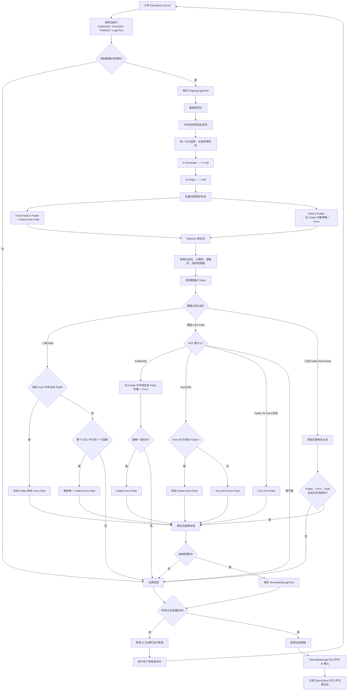

# Rave Studio AI

单一 WPF 应用，整合 EDC/SDS、Matrix、Edit Check 和 RWS 数据功能。

## 当前结构

- 一个 `.NET 9 WPF` 项目
- 一个主窗口；EDC/SDS、Matrix、OpenQuery、SetDataPointVisible、ECS 手动创建、RWS、AI 配置和日志中心均为独立页面
- HandyControl 全局主题
- JSON 多 AI 配置，下拉选择后可即时应用
- 每次 AI 请求使用开始时的配置快照，切换 Profile 从下一次请求生效
- 日志按模块保存在 `Logs` 子目录，可在应用内的“日志中心”打开
- 生成的 Excel 等成果保存在 `Output`，不与日志混放
- Excel 统一采用 ClosedXML
- Word 延续使用 DocX

## AI 配置

默认配置文件位于 `Config/ai-configs.json`。可以预设多个 Profile，并在应用内选择、编辑和保存。新配置从下一次 AI 请求开始生效，不需要重启应用。

## Matrix Builder

Matrix Builder 根据项目的 Form OID、Visit/Folder OID 和 DM 提供的 Matrix 场景文件，生成可用于 Rave 的 Matrix Excel。

### 第一步：准备 Forms 和 Folders

推荐先在“项目入口”上传经过人工确认的 SDS。进入 Matrix 页面时，程序直接复用入口页已经解析好的 `Forms` 和 `Folders`，不会重复读取 Excel；如果入口页重新上传了 SDS，再次进入 Matrix 页面时会同步最新结果。

也可以在 Matrix 页面单独上传 OID 模板。程序按以下规则读取：

- 优先查找名为 `Folders` 的 Sheet，并读取 Visit/Folder OID。
- 优先查找名为 `Forms` 的 Sheet，并读取 Form OID。
- 如果找不到指定名称，则将第一个 Sheet 作为 `Folders`、第二个 Sheet 作为 `Forms`，因此这种情况下必须注意 Sheet 顺序。
- 程序会尝试根据 `OID`、`FormOID`、`FolderOID`、`VisitOID` 等表头确定 OID 列；找不到表头时读取第一列。
- OID 不区分大小写去重，支持逗号、分号、空格、Tab 和换行分隔。

### 第二步：上传 DM Matrices 文件

场景文件优先读取名为 `Matrices` 的 Sheet；如果不存在，则读取第一个 Sheet。前四列必须依次表达以下内容：

| Matrix | OID | Folder | Form |
| --- | --- | --- | --- |
| Primary Matrix | PRIMARY | SCN | SV1, DM |
|  |  | COM | IC |
|  |  | EN | IE, ENROLL |
| SCR | SCR_AE | SCN | MH, ALH, SU, VS1, EG2, PE |
|  |  | AE | AEYN |
| V2(D-1)_SV | PREVD1_SV | V2 | SV2, CONT |

解析规则：

- A 列为 Matrix 名称，B 列为需要在 Architect 中配置或已经配置的 Matrix OID。
- A、B 列允许使用合并单元格；程序会把合并区域左上角的值应用到区域内每一行。
- C 列为 Visit/Folder OID。
- D 列可以填写多个 Form OID，支持逗号、中文逗号、分号、中文分号、空格、Tab 和换行分隔。
- 一个 Matrix/OID 可以跨多行记录，程序会把每个 Folder/Form 组合展开成独立关系。

例如 `SCR / SCR_AE` 跨两行时，会被展开为：

| Matrix | OID | Folder | Form |
| --- | --- | --- | --- |
| SCR | SCR_AE | SCN | MH |
| SCR | SCR_AE | SCN | ALH |
| SCR | SCR_AE | SCN | SU |
| SCR | SCR_AE | AE | AEYN |

### 校验、预览和导出

- Matrix、Matrix OID、Folder/Visit OID 或 Form OID 为空时记录为 `Error`。
- Folder/Visit OID 或 Form OID 不在 SDS/OID 模板中时记录为 `Warning`，对应交叉点不会生成 `X`。
- 页面可以按 Matrix 切换预览，并显示表单数、访视数和 `X` 数量。
- 每个 Matrix OID 导出为一个 Sheet，名称格式为 `Matrix{序号}#{大写MatrixOID}`，例如 `Matrix1#PRIMARY`；重名或超长名称会被安全处理。
- 第 1 行包含 `Matrix: OID`、`Subject` 和各 Visit/Folder OID；后续每行对应一个 Form OID，匹配的交叉位置标记为 `X`。
- 导出文件固定保存为 `Output/Matrix/allSubMatrices.xlsx`。再次导出会更新该文件，可使用页面上的“打开输出目录”按钮定位。

## RWS 配置

RWS 配置位于 `Config/rws-configs.json`，按“租户 → 试验 → 环境 → Forms”维护。租户节点同时保存用户名和密码。

Rave 生产环境返回的 `Environment` 可能是空字符串，因此生产环境必须使用空字符串 `""` 作为配置 key。界面和历史记录会显示为 `Prod`，但配置查找以及传给 RWS SDK 的值仍为 `""`；在界面手工输入 `Prod` 保存时也会自动转换为 `""`。

配置结构示例：

```json
{
  "selectedTenant": "your-subdomain",
  "tenants": {
    "your-subdomain": {
      "username": "your-username",
      "password": "your-password",
      "studies": {
        "PROJECT001": {
          "UAT": ["DM", "AE"],
          "": ["DM", "AE"]
        },
        "PROJECT002": {
          "DEV": ["SUBJ", "VS"],
          "UAT": ["SUBJ", "VS", "AE"]
        }
      }
    },
    "another-subdomain": {
      "username": "another-username",
      "password": "another-password",
      "studies": {
        "PROJECT101": {
          "": ["DM", "AE", "CM"]
        }
      }
    }
  }
}
```

`tenants`、`studies` 和每个试验下的环境虽然使用 JSON 对象而不是数组，但都可以包含任意多个条目，并以名称作为唯一 key，便于按租户、试验和环境直接查找。

Forms 必须按租户、试验和环境在配置中维护，不会使用项目入口上传的 SDS Forms 自动替代。用户连接 RWS 后可以自由切换当前账号可见的试验；程序会根据所选试验的 `ProtocolName/Oid + Environment` 查找对应 Forms。

## RWS 数据查询

- 输入或选择租户配置后连接 RWS，加载当前账号可见的试验。
- 选择试验后加载受试者，以及该试验和环境在配置文件中维护的 Forms。
- 支持按文本筛选受试者和表单，并支持全选/取消。
- 支持下载 `regular` 或 `raw` 数据集。程序按“表单 × 受试者”逐个请求，查询中断时保留已经返回的数据。
- 查询结果按 FormOID 分组预览，通过“预览表单”下拉框切换；不同表单的数据和动态字段不会混在同一张表格中。每页显示 50 行。
- 查询结果可使用简单表达式筛选，支持 `=`、`!=`、`contains`、`in (...)`、`is null`、`is not null`，以及最多一个 `and/or`；筛选后会重新计算各表单的行数和分页。
- 查询历史保留在当前程序运行期间；双击历史记录会使用当时的租户、试验、环境、数据集类型、受试者和表单重新查询。
- 数据可导出为 Excel，并按 FormOID 分 Sheet 保存。

生产环境的关键规则：RWS 返回的生产环境可能为 `""`。界面和历史记录将其显示为 `Prod`，但查询请求仍使用空字符串，不能把显示文字 `Prod` 直接传给 RWS SDK。

## RWS Query 发送

发送页读取 Excel 第一张 Sheet，第一行必须按顺序严格包含以下列名：

```text
SiteOID, Subject, FolderOID, FolderRepeatNumber, FormOID, FormRepeatNumber, RecordPosition, FieldOID, Data, Specify, Query, Status
```

示例：

| SiteOID | Subject | FolderOID | FolderRepeatNumber | FormOID | FormRepeatNumber | RecordPosition | FieldOID | Data | Specify | Query | Status |
| --- | --- | --- | --- | --- | --- | --- | --- | --- | --- | --- | --- |
| Sim_UAT_Test_998 | 1998416 | SCR | 0 | SV | 0 |  | VISDAT | 2025/11/UK |  | testQuery | New |
| Sim_UAT_Test_998 | 1998416 | SCR | 0 | MH | 0 | 1 | MHONGO | 1 |  | testQuery | New |
| Sim_UAT_Test_998 | 1998416 | COM | 0 | AE | 0 | 5 | AESTDAT | 2025/11/2 |  | testQuery | New |
| Sim_UAT_Test_998 | 1998416 | UP | 3 | UNS | 0 |  | UPRES | 99 | other unknown reasons | testQuery | New |

程序会将每行组装为 Query ODM XML，并逐条发送。单行失败不会终止后续行；界面记录 `Sending`、`Success` 或 `Failed` 状态。可以导出全部结果，也可以只导出失败结果；导出文件会在最后增加 `ErrorMessage` 列。

当前 Query XML 延续旧项目的序号规则：数值形式的 `FolderRepeatNumber` 和 `FormRepeatNumber` 在写入 ODM 时会加 `1`，`RecordPosition` 写入 `ItemGroupRepeatKey`。这三个字段属于真实 Rave 环境测试时应优先确认的业务约定。

## RWS 安全说明

- `rws-configs.json` 会以明文保存用户名和密码，只应存放在受控的本地电脑上。
- 不要将真实账号、密码、租户和试验配置提交到公开仓库。
- 批量发送 Query 会改变 Rave 中的数据状态，正式发送前应先在测试环境用少量记录验证模板、重复序号和接收组。

## OpenQuery 前置校验

OpenQuery 上传文件后，程序保留原始 `LogicText`，同时生成 `NormalizedLogicText`。只有文件中的所有行都通过目标数据点、表达式数据点和结构校验，才允许调用 AI；AI 使用 `NormalizedLogicText`，不使用原始文本。校验失败时，用户在线下修改源文件并重新上传。



数据点省略规则：

- `VISDAT`：优先解释为当前 Folder、当前 Form 下的字段；不在当前 Form 时，只有整个 EDC 中位置唯一才允许裸写。
- `V2.VISDAT`：固定 Folder `V2`，在该 Folder 中寻找包含 `VISDAT` 的唯一 Form。
- `SV2.VISDAT`：固定 Form `SV2`；位于当前 Folder 时使用当前 Folder，否则使用 `ALLVISIT`。
- `V2.SV2.VISDAT`：完整地址，严格校验三者关系，不自动改成 `ALLVISIT`。
- `Field(in V2)` 和 `Form.Field(in V2)`：先转换为标准三段式地址；普通数学括号保持不变。
- 当前 Form 内的字段、日期加时间表达式，以及 `3d`、`2h`、`30min`、`3Mon` 等时间常量均为合法写法。

## Blind 审阅与生成流程

Blind 上传后会执行基础校验，并在“建议补全结果”列展示程序推测的上游激活条件。建议结果只供人工审阅，程序不会用它覆盖原始 `LogicText`。即使部分行校验失败，其他可解析行仍会继续生成建议。

用户可将审阅文件导出到 `Output/EditCheck/BlindValidation.xlsx`，在线下确认或修改后，把认可的建议结果覆盖至 `LogicText`，删除最后三列辅助信息，再次上传。生成 ECS 时始终以本次上传的 `LogicText` 为准；仍有校验错误时允许强制生成，单行转换失败不会中断其他行。
